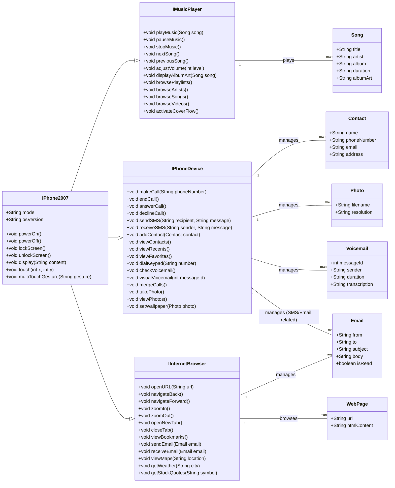

# DIO - POO - Desafio - Modelagem UML e Implementação Java do iPhone (2007)

Este projeto tem como objetivo principal demonstrar a aplicação de conceitos de **Modelagem UML (Unified Modeling Language)**, especificamente Diagramas de Classe e Interface, para representar as funcionalidades de um produto complexo como o iPhone original, lançado em 2007. Além da modelagem, o projeto inclui uma implementação básica dessas funcionalidades em **Java**.


A base para este projeto foi a transcrição do vídeo de lançamento do iPhone em 2007, com foco nas funcionalidades de:

1.  **Reprodutor Musical (iPod)**
2.  **Aparelho Telefônico**
3.  **Navegador na Internet**

## Sumário

* [Visão Geral do Projeto](#visão-geral-do-projeto)
* [Diagrama UML](#diagrama-uml)
* [Estrutura do Projeto](#estrutura-do-projeto)
* [Como Compilar e Executar](#como-compilar-e-executar)
* [Tecnologias Utilizadas](#tecnologias-utilizadas)
* [Contribuição](#contribuição)
* [Licença](#licença)

## Visão Geral do Projeto

O iPhone de 2007 foi apresentado como a convergência de três produtos revolucionários. Este projeto traduz essa visão para um modelo de software, utilizando interfaces Java para definir os "contratos" de cada funcionalidade (reprodutor musical, telefone, navegador) e uma classe principal (`iPhone2007`) que implementa todas essas interfaces, demonstrando o conceito de polimorfismo e composição de funcionalidades.

### Objetivos:

* **Aplicar UML:** Utilizar Diagramas de Classe e Interface para modelar um sistema real.
* **Representar Funcionalidades:** Capturar os papéis primários do iPhone (Música, Telefone, Internet) através de interfaces bem definidas.
* **Implementação Java:** Fornecer uma implementação básica em Java que reflita o design UML.
* **Educação:** Servir como um exemplo prático para estudantes de Engenharia de Software e Programação Orientada a Objetos.

## Diagrama UML

O diagrama abaixo ilustra as classes, interfaces e seus relacionamentos. A classe `iPhone2007` implementa as interfaces `IMusicPlayer`, `IPhoneDevice` e `IInternetBrowser`, mostrando como o dispositivo integra as três funcionalidades principais.


## Estrutura do Projeto
O projeto é organizado da seguinte forma:
```txt
├── src/
│   ├── main/
│   │   ├── java/
│   │   │   ├── Contact.java
│   │   │   ├── Email.java
│   │   │   ├── IInternetBrowser.java
│   │   │   ├── IMusicPlayer.java
│   │   │   ├── IPhoneDevice.java
│   │   │   ├── iPhone2007.java
│   │   │   ├── Photo.java
│   │   │   ├── Song.java
│   │   │   ├── Voicemail.java
│   │   │   └── WebPage.java
└── README.md
```
src/main/java/: Contém todos os arquivos .java das interfaces e classes.

## Como Compilar e Executar

Para compilar e executar este projeto, você precisará ter o Java Development Kit (JDK) instalado em sua máquina (versão 8 ou superior é recomendada).

1 - Clone o repositório:

```bash
git clone [https://github.com/seu-usuario/nome-do-repositorio.git]
```

2 - Navegue até a pasta java:

```bash
cd src/main/java/
```

3 - Compile os arquivos Java:

```bash
javac *.java
```

4 - Execute a classe principal iPhone2007:

```bash
java iPhone2007
```

## Tecnologias Utilizadas
* UML (Unified Modeling Language): Para a fase de design e modelagem.

* Mermaid: Para gerar o diagrama UML diretamente no Markdown.

* Java: Linguagem de programação para a implementação das classes e interfaces.

## Contribuição

Contribuições são bem-vindas! Se você tiver sugestões para melhorar o modelo UML, a implementação Java, ou o próprio README, sinta-se à vontade para:

* Abrir uma Issue para discutir a mudança.

* Criar um Pull Request com suas alterações.

### Licença

Este projeto está licenciado sob a Licença MIT.
